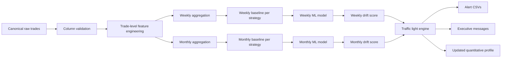

# ML Monitoring Pipeline — Quantitative Drift Detection with Traffic Light

## Objective

This pipeline takes **canonical trade-level quantitative data** and builds a monitoring system with three performance states:

- **Green**: the strategy continues to operate within safe historical parameters.
- **Yellow**: there is drift, but not yet enough evidence to stop trading. Under surveillance.
- **Red**: behavior has deviated significantly from baseline. The system recommends **fully pausing** until reviewed.

## Key design principle

The **quantitative profile snapshot** (medical card) works well as an executive output, but the monitoring model learns better from the **trade-level historical record**.

- **Model input**: canonical trades file
- **Executive output**: quantitative profile, scorecards, alerts, traffic light

## Minimum expected input

The code is prepared to work with these minimum columns:

- `trader_id`
- `close_time`
- `pnl_net`

Optional columns that improve the model:

- `quality_flag`
- `symbol`
- `volume`
- `holding_minutes`
- `risk_pct`
- `slippage`

## What the system learns

The system does **not** try to predict the next trade.

It **learns the strategy's normal behavior** from history and detects when that behavior deviates.

This works in two layers:

### Layer 1 — Robust statistical rules

Compares each week and month against the historical baseline using:

- Expectancy
- Profit factor
- Win rate
- PnL volatility
- Trade frequency
- Loss streaks
- Symbol concentration
- Position size stability

### Layer 2 — Unsupervised ML

Trains an `IsolationForest` model per strategy and per horizon:

- One weekly model
- One monthly model

Each model learns the strategy's "normal zone."
When a week or month falls far outside that zone, the **anomaly score** rises.

## Traffic light logic

The system uses a hybrid logic: **hard rules + drift score + ML**.

### Green

Maintained when:
- No hard breaches
- Severity score below yellow threshold
- ML anomaly score is low

### Yellow

Triggered when:
- Moderate deterioration detected
- Relevant change in expectancy, win rate, PF, or PnL volatility
- ML anomaly score is medium
- Not yet enough evidence to pause

### Red

Triggered when:
- Clear hard breach
- Total severity score exceeds red threshold
- ML anomaly score is high AND coincides with operational deterioration

To avoid overreaction, red does not depend on a single cosmetic metric.
The focus is on **genuine regime change**, not micro-noise.

## Suggested hard breach conditions

The hard breaches are intentionally defined to avoid over-regulation:

1. `expectancy < 0` **AND** strong drop vs baseline
2. `profit_factor < 0.90` with confirmed deterioration
3. Extreme weekly or monthly loss + high anomaly score
4. Two consecutive weeks in red with worsening trend
5. Sharp quality drop accompanied by increased volatility or loss streak

## Pipeline outputs

When the system runs, it produces:

- `weekly_features.csv`
- `monthly_features.csv`
- `weekly_alerts.csv`
- `monthly_alerts.csv`
- `trader_status_latest.csv`
- `alert_messages.json`

## Full pipeline flow

## Alert types

### 1. Operational alert (for dashboard / Slack / email integration)
- Strategy name
- Period
- Traffic light color
- Score
- Metrics that deteriorated
- Recommendation

### 2. Executive alert (plain text summary)
- **Green** → continue trading
- **Yellow** → hold size and monitor
- **Red** → pause trading and review

## Recommended usage

- Use **weekly** signal as tactical trigger
- Use **monthly** signal as strategic trigger
- Only pause on red when there is sufficient corroborating evidence
- Use the quantitative profile to document the decision rationale

## Files included in this package

- `monitoring_ml_pipeline.py`
- `monitoring_config.json`
- `README_PIPELINE_ML_SEMAFORO.md` (this file)
